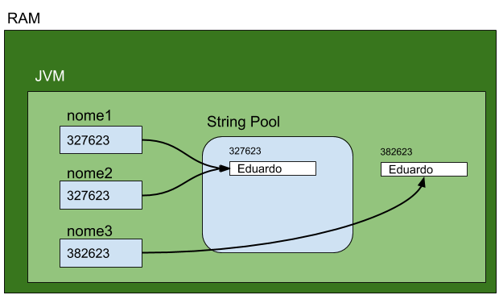
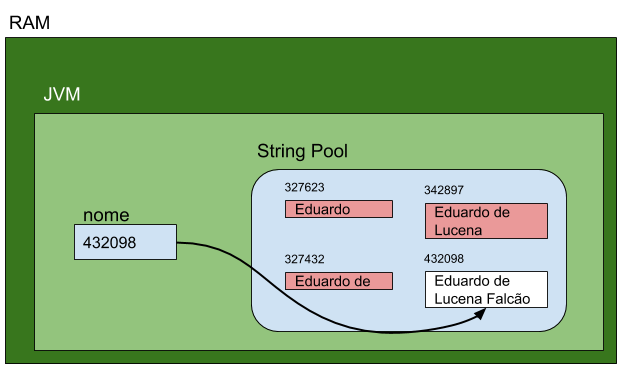
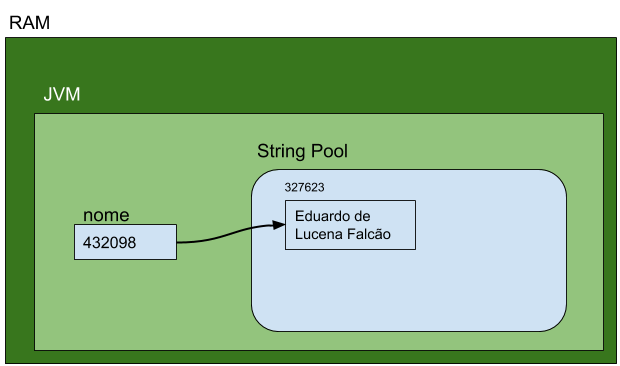

# Strings

## String não é um tipo primitivo

Creio que nesse ponto do curso todo mundo saiba o que é uma String: uma sequência de caracteres, ou seja, um texto.
O que talvez vocês não soubessem, é que String não é um tipo primitivo.
Note que ela começa com letra maiúscula, que é uma recomendação para classes em Java.
E é isto: uma String é uma classe, com seus métodos, assim como toda classe tem.
Portanto, quando criamos uma String, na verdade nós instanciamos um objeto da classe String.
Você pode se perguntar: "pra instanciar um objeto, eu não preciso usar o **new** e um contrutor da classe?"
E eu te respondo que sim, você está correto. 

Observe o trecho de código a seguir:


```java
String nome = "Eduardo";
String sobrenome = new String("Falcao");
```

Ambas as variáveis *nome* e *sobrenome* apontam para objetos.
Vocês lembram daquela história de que toda classe tem um contrutor, mesmo que ele seja oculto (pois a JVM injeta o código do construtor na classe)?
Aqui acontece algo parecido.
O fato é que é tão comum usarmos Strings em nossos programas que os criadores do Java acharam que seria mais interessante ter uma forma mais rápida de criar uma String, omitindo a chamado ao construtor, e consequentemente omitindo o *new*.

## Principais métodos da classe String

Como String é uma classe, uma consequência disso é que ela pode ter métodos.
E de fato ela tem, se encontra aqui: https://docs.oracle.com/javase/7/docs/api/java/lang/String.html

No exemplo a seguir, mostro a vocês as principais operações:


```java
String nome = "Eduardo de Lucena Falcao";

//charAt(indice)
System.out.println("Iniciais: "+nome.charAt(0)+"."+nome.charAt(11)+"."+nome.charAt(18));

//contains
System.out.println(nome.contains("Eduardo"));
System.out.println(nome.contains(" "));
System.out.println(nome.contains(" de"));
System.out.println(nome.contains("z"));

//indexOf
System.out.println(nome.indexOf("Falcao"));
System.out.println(nome.indexOf("o"));

//lastIndexOf
System.out.println(nome.lastIndexOf("o"));

//isEmpty
System.out.println(nome.isEmpty());

//replace
System.out.println(nome.replace("Eduardo","EDUARDO"));
System.out.println(nome);
System.out.println(nome.replace(" ","-"));
System.out.println(nome);

//substring
System.out.println(nome.substring(0,7));

//toLowerCase
System.out.println(nome.toLowerCase());

//toUpperCase
System.out.println(nome.toUpperCase());
```

Se sabemos inglês, então o nome das funções consegue dar uma boa intuição do que ela faz.
Não é nosso objetivo decorar todos os métodos.
Mas é importante saber que existem, e é interessante ter uma noção dos mais comumente utilizados.
No dia-a-dia do seu trabalho, é muito comum recorrer às APIs para lembrar ou conhecer como funciona determinado método.

Note também que cada operação que executamos gera um novo objeto.
Perceba que as alterações que fizemos na String nome não se acumularam.
Se você quiser fazer algo nesta direção, você precisará reatribuir o resultado da operação à variável.

Assuma que a partir da variável String nome = "Eduardo de Lucena Falcao", queremos que nome assuma o valor "EDUARDO".
Poderíamos fazer isto da seguinte forma:

```java
String nome = "Eduardo de Lucena Falcao";

nome = nome.substring(0,6);
nome = nome.toUpperCase();

System.out.println(nome);
```

## Mais um exemplo de sobrecarga

A classe String possui uma função chamada "concat", que serve para concatenar duas Strings.
No entanto, raramente usamos "concat", pois há umma forma mais simples de fazer isto: utilizando o operador +.
Note que + é um operador que permite somar valores numéricos, bem como concatenar Strings.
Por isso, dizemos que **+** é um operador sobrecarregado.

Veja o exemplo a seguir:

```java
String nome = "Eduardo";
String sobrenome = "Falcao";

System.out.println(nome);
System.out.println(sobrenome);
System.out.println(nome+sobrenome);

nome.concat(sobrenome);
System.out.println(nome);
```

## Objetos, == e equals

Uma String sempre é um objeto.
Já sabemos que, quando os valores a ser comparados não são de tipos primitivos, == compara o endereço de memória dos objetos.
Logo, uma comparação com == entre duas Strings só resultará em *true* se os as duas variáveis se referirem ao mesmo objeto.
Por outro lado, sabemos que o método *equals* compara o conteúdo dos objetos.

Observe o exemplo a seguir:

```java
String nome1 = "Eduardo";
String nome2 = "Eduardo";
String nome3 = new String("Eduardo");

System.out.println(nome1==nome2);	 //true
System.out.println(nome1==nome3);	 //false
System.out.println(nome1.equals(nome2)); //true
System.out.println(nome1.equals(nome3)); //true

nome3 = nome2;

System.out.println(nome1==nome3);	 //true
System.out.println(nome2==nome3);	 //true
System.out.println(nome1.equals(nome3)); //true
System.out.println(nome2.equals(nome3)); //true
```

O precisamos perceber é que no Java existe o que chamamos de "String pool".
Se você instanciar uma String **sem a palavra chave new**, então o Java tentará economizar memória, verificando se já existe um objeto com aquele mesmo conteúdo criado.
Em caso positivo, ele reaproveita aquele objeto, atribuindo seu endereço de memória à variável.
Por outro lado, sempre que uma String for **criada usando explicitamente a palavra reservada new**, então independente de já haver um objeto String com aquele conteúdo criado, a JVM criará um novo objeto.

A imagem a seguir ilustra o que aconteceu no exemplo anterior:



Por essa razão, sempre que quiser comparar o conteúdo de duas Strings, use o método **equals**.

## Imutabilidade de Strings

**Em Java, Strings são objetos imutáveis.**
O que isso quer dizer?
Quer dizer que toda vez que você altera uma String, na verdade, você cria um novo objeto String e o anterior ficará ocupando espaço na memória até o *Garbage Collector* ser executado e removê-lo.

Veja o exemplo a seguir:

```java
String nome = "Eduardo";
nome += " de";
nome += " Lucena";
nome += " Falcao";

System.out.println(nome);
```

Nesse exemplo, a princípio, um objeto String foi criado para armazenar "Eduardo".
Em seguida, uma nova String, "Eduardo de", foi criada. Nesse momento, a String "Eduardo" existe na memória mas não é usada.
Depois, uma nova String, "Eduardo de Lucena", foi criada. Nesse momento, as Strings "Eduardo" e "Eduardo de" existem na memória mas não são usadas.
E isto acontece sucessivamente.

Observe este fato na ilustração a seguir:



## StringBuilder

Se você precisar economizar espaço de memória, StringBuilder é a solução.
Objetos de StringBuilder são mutáveis, e nesse caso, sempre que você alterar um StringBuilder, nenhum objeto adicional precisa ser criado.

```java
StringBuilder nomeCompleto = new StringBuilder("Eduardo");
nomeCompleto.append(" de");
nomeCompleto.append(" Lucena");
nomeCompleto.append(" Falcao");

System.out.println(nomeCompleto);
```

Nesse caso, apenas um objeto é criado. Nenhuma memória é "desperdiçada".
Esse código poderia ser representado com a seguinte imagem:



---

[Código sobre Strings](../src/conteudo/OperacoesComString.java)

---

[Exercícios de Classes, Objetos e Construtores](exercicios/Strings.md)
