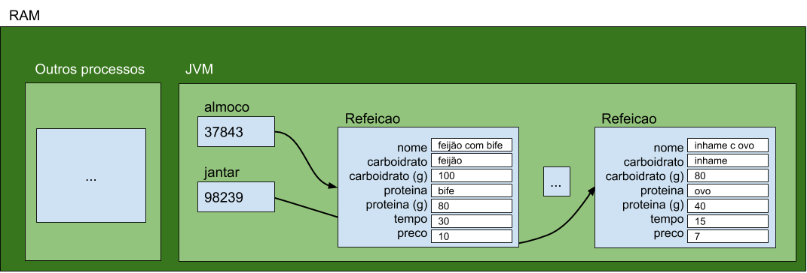
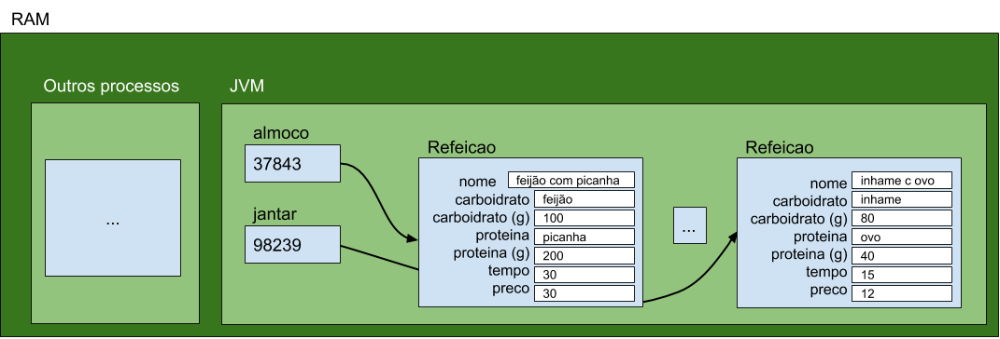
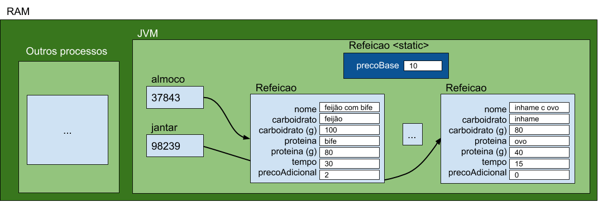
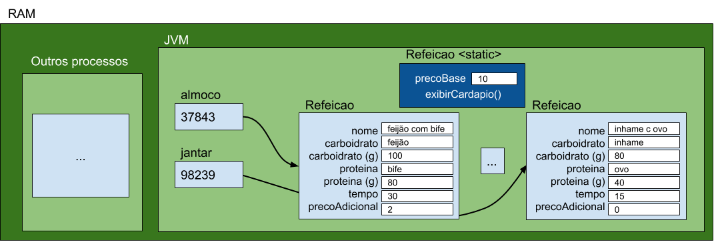

# Variáveis e Métodos de Instância e de Classe

## Variáveis de Instância e de Classe

Vocês já devem ter percebido que utilizamos o verbo **instanciar** como sinônimo de **criar um objeto**.
Portanto, quando alguém te pedir para instanciar um objeto de uma determinada classe, essa pessoa está te pedindo simplesmente para você criar um objeto daquela classe.

No mundo de programação orientada a objetos, podemos ter dois tipos de variáveis: as **variáveis de instância**, e as variáveis de **classe**.

Sempre que usamos a palavra reservada *new* em conjunto com um construtor, um objeto é criado.
Todo objeto criado carrega consigo variáveis de instância.
As variáveis de instância são, portanto, os atributos, que cada objeto traz consigo.
Toda variável que é declarada  **sem usar a palavra reservada static** é uma variável de instância (ou objeto, como queiram).

Vamos tomar como exemplo a seguinte classe Refeicao:

```java
class Refeicao{
	String nome;
	String carboidrato;
	int gramasCarboidrato;
	String proteina;
	int gramasProteina;
	int tempoCozimento; 
	double preco; 
	
	public Refeicao(String nome, String carboidrato, int gramasCarboidrato, String proteina, int gramasProteina, int tempoCozimento, double preco) {
		this.nome = nome;
		this.carboidrato = carboidrato;
		this.gramasCarboidrato = gramasCarboidrato;
		this.proteina = proteina;
		this.gramasProteina = gramasProteina;
		this.tempoCozimento = tempoCozimento;
		this.preco = preco;
	}
}

class MainRefeicao{
	public static void main(String [] args){
		Refeicao almoco = new Refeicao("feijão com bife", "feijao", 100, "bife", 80, 30, 10);
		Refeicao jantar = new Refeicao("inhame com ovo", "inhame", 80, "ovo", 40, 15, 7);
	}
}
```

No exemplo acima, instanciamos dois objetos: um almoço e um jantar.
Cada objeto instanciado tem seu próprio espaço bem definido na memória RAM, e nele estão contidas as variáveis do objeto (ou da instância).
Uma representação gráfica desses objetos na memória RAM poderia ser a seguinte:



Note que cada objeto tem seus atributos com valores diferentes.
Esses atributos são as variáveis de instância.
Se nós mudarmos os valores dos atributos do objeto referenciado pela variável almoço, os valores dos atributos objeto referenciado pela variável jantar **não mudam**.
Isto acontece pois essas variáveis são de instância e, portanto, pertencem ao objeto que foi criado.

No exemplo a seguir, depois de criar os objetos, alguns valores de atributos do objeto refenciado pela variável almoço e o preço do objeto refenciado pela variável jantar são alterados.

```java
class MainRefeicao{
    public static void main(String [] args){
        Refeicao almoco = new Refeicao("feijão com bife", "feijao", 100, "bife", 80, 30, 10);
        Refeicao jantar = new Refeicao("inhame com ovo", "inhame", 80, "ovo", 40, 15, 7);
        
        almoco.nome = "feijão com picanha";
        almoco.proteina = "picanha";
        almoco.gramasProteina = 200;
        almoco.preco = 30;
        
        jantar.preco = 12;
    }
}
```

Ilustramos essa mudança com a seguinte imagem:



Além das variáveis de instância também existem as **variáveis de classe (ou estáticas)**.
Variáveis de classe não pertencem ao contexto do objeto.
Não é preciso criar objetos para que as variáveis de classe existam.
Variáveis de classe independem da existência de objetos.

No exemplo anterior, se quiséssemos configurar um preço básico de 10 reais todo e qualquer tipo de refeição, poderíamos criar uma variável de classe.
Para criar uma variável de classe, basta declará-la como **static**.

Observe o exemplo a seguir:

```java
class Refeicao{

  	//variáveis estáticas
	static double precoBase;
  
  	//variáveis de instância
  	String nome;
	String carboidrato;
	int gramasCarboidrato;
	String proteina;
	int gramasProteina;
	int tempoCozimento; 
	double precoAdicional; 
	
	public Refeicao(String nome, String carboidrato, int gramasCarboidrato, String proteina, int gramasProteina, int tempoCozimento, double precoAdicional) {
		this.nome = nome;
		this.carboidrato = carboidrato;
		this.gramasCarboidrato = gramasCarboidrato;
		this.proteina = proteina;
		this.gramasProteina = gramasProteina;
		this.tempoCozimento = tempoCozimento;
		this.precoAdicional = precoAdicional;
	}
}

class MainRefeicao{
	public static void main(String [] args){
		Refeicao.precoBase = 10;
		
		Refeicao almoco = new Refeicao("feijão com bife", "feijao", 100, "bife", 80, 30, 2);
		Refeicao jantar = new Refeicao("inhame com ovo", "inhame", 80, "ovo", 40, 15, 0);
	}
}
```

No exemplo anterior, antes mesmo de criar qualquer objeto eu defini que o preço mínimo de qualquer refeição seria 10 reais.
Em seguida, criei um objeto representando um almoço, e um objeto representando um jantar.
Note que ambos os objetos terão um preço base de 10 reais.
Embora a variável não esteja dentro da área de memória do objeto, os objetos conseguem enxergá-las e manipulá-las.
Neste caso, o almoço custa 10+2 reais, e o jantar custa 10+0 reais.

Segue ilustração:



É uma boa prática e extremamente recomendado que use o nome da classe para referenciar variáveis estáticas.
Ex: "Refeicao.precoBase = 10;".
Embora dentro da classe Refeicao usar apenas o nome da variável funcione, essa recomendação também deve ser seguida.

## Métodos de Instância e de Classe

A mesma ideia básica se aplica aos métodos.
Métodos de instância pertencem aos objetos.
Métodos de instância só podem ser executados sobre um objeto, depois que ele for criado.
Métodos estáticos pertencem à classe.
Portanto, métodos estáticos não dependem da existência de um objeto para serem executados.

Para exemplificar uma situação que talvez fizesse sentido usar um método estático vamos usar nossa imaginação :)
Imagine que exista um método que sirva de cardápio.
O método exibirCardápio simplesmente retorna todos os carboidratos, proteínas e bebidas, com seus respectivos valores.
Note que para pedir um cardápio, não precisa existir nenhuma refeição, a princípio.
Mas, de algum modo, exibirCardápio é relacionado a refeições, e por isso, queremos colocar dentro da classe Refeicao.

Nosso código ficaria da seguinte maneira:


```java
class Refeicao{

  	//variáveis estáticas
	static double precoBase;
  
  	//variáveis de instância
  	String nome;
	String carboidrato;
	int gramasCarboidrato;
	String proteina;
	int gramasProteina;
	int tempoCozimento; 
	double precoAdicional; 
	
	public Refeicao(String nome, String carboidrato, int gramasCarboidrato, String proteina, int gramasProteina, int tempoCozimento, double precoAdicional) {
		this.nome = nome;
		this.carboidrato = carboidrato;
		this.gramasCarboidrato = gramasCarboidrato;
		this.proteina = proteina;
		this.gramasProteina = gramasProteina;
		this.tempoCozimento = tempoCozimento;
		this.precoAdicional = precoAdicional;
	}
	
	public static String exibirCardapio(){
		String cardapio = "Carboidratos: \n";
		cardapio += "Inhame - R$5\n";
		cardapio += "Batata doce - R$5\n";
		cardapio += "Feijão - R$7\n";
		cardapio += "Cuscuz - R$4\n";
		cardapio += "\n";
		cardapio += "Proteínas:\n";
		cardapio += "Ovo - R$2\n";
		cardapio += "Bife - R$6\n";
		cardapio += "Maminha - R$7\n";
		cardapio += "Picanha - R$15\n";
		cardapio += "\n";
		cardapio += "Bebidas:\n";
		cardapio += "Refrigerante lata - R$5\n";
		cardapio += "Refrigerante 1l - R$9\n";
		cardapio += "Refrigerante 2l - R$15\n";
		cardapio += "Suco - R$5\n";
		cardapio += "Café - R$2\n";
		cardapio += "Picanha - R$15\n";
		return cardapio;
	}
}

class MainRefeicao{
	public static void main(String [] args){
		Refeicao.precoBase = 10;
		
		System.out.println(Refeicao.exibirCardapio());
		
		Refeicao almoco = new Refeicao("feijão com bife", "feijao", 100, "bife", 80, 30, 2);
		Refeicao jantar = new Refeicao("inhame com ovo", "inhame", 80, "ovo", 40, 15, 0);
	}
}
```

Note que neste exemplo nós conseguimos exibir o cardápio sem ter um objeto da classe Refeicao.
Isto acontece porque o método **exibirCardapio()** é estático, não requerindo a existência de um objeto para ser executado.
O método estático, assim como a variável estática, também pertence à classe, e poderia ser representado da seguinte forma:



É interessante também perceber que não faria muito sentido a função exibirCardapio() ser uma função de instância.
Se assim o fosse, primeiro seria preciso criar um objeto de Refeicao, mas nesse caso o cliente ainda não saberia quais seriam as opções disponíveis.
